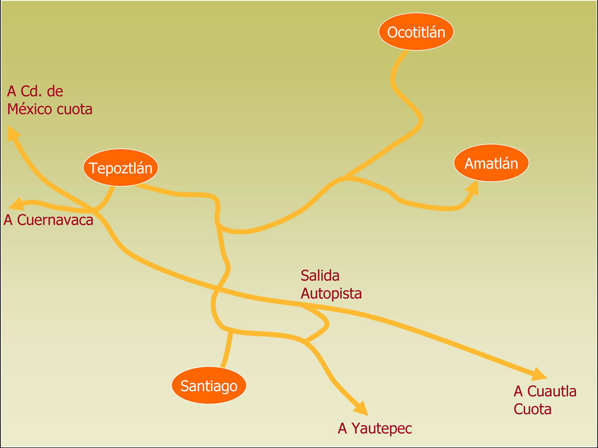


<!-- Content Area Start -->

      

   
      <!-- CONTACT FORM -->     
	

	
	      
          

            <h3 class="title-head text-center">Contactanos</h3>
            <form class="contact-form" data-toggle="validator">
              

                

                  

                    <i class="contact-icon fa fa-user"></i>
                    <input type="text" class="form-control" id="name" placeholder="Nombre completo" required data-error="Ingrese su nombre">
                    

                  

                

                

                  

                    <i class="contact-icon fa fa-envelope-o"></i>
                    <input type="email" class="form-control" id="email" placeholder="Email" required data-error="Ingrese su email">
                    

                  

                

                

                  

                    <i class="contact-icon fa fa-pencil-square-o"></i>
                    <input type="text" class="form-control" id="subject" placeholder="Tema" required data-error="Ingrese el tema">
                    

                  

                

                

                  

                    <textarea id="message" rows="8" placeholder="Mensaje" required data-error="Escriba su mensaje"></textarea>
                    

                  

                  <button type="submit" id="form-submit" class="btn btn-common btn-form-submit">Mandar mensaje</button>
                  

                  

                

              

            </form>
          

          

            <h4 class="contact-info-title">Information de Contacto</h4>
            

              <address>
							<i class="fa fa-map-marker icons cyan-color contact-info-icon"></i>
							Calle Tepepexpan s/n esq. 20 de Noviembre,
							 
							Amatlán de Quetzalcoatl, Municipio de Tepoztlán,
              Morelos, Mexico C.P. 62525  
						</address>
              

                <a href="tel:+52(1739)3933194"><i class="fa fa-phone icons cyan-color contact-info-icon"></i>01(739)3933194</a>
              

              <a href="mailto:contacto@atekokolli.org"><i class="fa fa-envelope-o icons cyan-color contact-info-icon"></i>contacto@atekokolli.org</a>
              
<strong>Horarios</strong>

              <ul class="horarios">
                <li>Lunes: Cerrado</li>
                <li>Martes: 10:30am-5:00pm</li>
                <li>Miercoles: Cerrado</li>
                <li>Jueves: 10:30am-5:00pm</li>
                <li>Viernes: 10:30am-5:00pm</li>
                <li>Sabado: 9:00am-2:00pm</li>
                <li>Domingo: Cerrado</li>
              </ul>
              <!--  -->
              
              
            

          

        

	

            
            
<!-- Content area end -->

