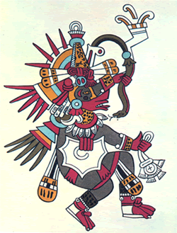


<!-- Content Area Start -->

      
                        

Aprovechando la abundancia regional del árbol amaquahuitl, que corresponde a la especie botánica Ficus petiolaris HBK, los habitantes prehispánicos de Amatlán diseñaron, dominaron y se dedicaron al proceso de elaboración de “papel amate”, cuya corteza se mezclaba con una sustancia pegajosa “tzacutli”, producida por los bulbos de una orquídea predominante en la zona, nombrada “amazauhtli”, y que corresponde a la especie Epidendrum pastoris_Llav y Lex.

Tal como corresponde a una comunidad de larga historia, resultante de la influencia de otras culturas, los habitantes todavía proclaman la antigua leyenda referente al nombre actual conocido como Amatlán de Quetzalcóatl, al señalarla como lugar de nacimiento del glorioso personaje Ce Acatl Topiltzin Quetzalcóatl.

Aunque durante la conquista le dieron el nombre de Santa María Magdalena, quien es considerada desde entonces la patrona del pueblo, y festejada cada 22 de julio.

El rescate de la información relativa a la historia de Amatlán inicia con lo ocurrido en el siglo X al pueblo tlauica, hablante del náhuatl, y habitante de Tepoztlán, quienes fueron invadidos y derrotados por una hueste nahua, bajo el liderazgo de Mixcoatl, (fundador del imperio tolteca). Por ello, los tepoztecos tuvieron que rendir tributo a los toltecas hasta 1437, cuando fueron dominados por los aztecas que, durante un siglo, recibieron esos tributos mediante telas, papel, granos y otros objetos. 

Al ocurrir la conquista de México Tenochtitlan en 1521, las localidades del municipio quedaron sometidos a la Corona Española, administrados por el Corregidor de Cuernavaca y dependientes de los misioneros dominicos, introductores de la transformación cultural y religiosa. No obstante, la población tepozteca tuvo que continuar o aumentar la elaboración de “papel amate” y algunas telas, para responder a las demandas del nuevo mercado español. Además de que Hernán Cortés había fijado el pago de impuestos con productos de la tierra, mismo que fueron entregados hasta 1567, cuando fue autorizado el pego con monedas.

Según Del Paso y Troncoso (1579), en las seis comarcas de Tepoztlán, vivían  963 familias indígenas que padecían la escasez de agua, pero trabajaban para obtener madera, maíz, frijol y muchas frutas, pues había más de 14.000 árboles frutales. Por causas diversas, durante los periodos de la conquista y la colonia, la población se redujo hasta ser de  2,540 personas, en el año de 1807.

Con las leyes de Reforma del Presidente benito Juárez, en 1857, las posesiones de la iglesia fueron repartidas entre algunos miembros de la población, quienes se transformarían  en los caciques gobernantes de esa localidad. Años más tarde, durante el Porfiriato, ellos mismos apoyaron la reinstalación de la iglesia y su fuerza conservadora; así como en 1897, la instalación del ferrocarril.

Tepoztlán sufrió muchas invasiones en la época revolucionaria, tanto de tropas insurgentes como del gobierno causantes de todo tipo de calamidades. Pero, como los tepoztecos siguieron al general Emiliano Zapata, lograron liberarse en 1914 del dominio de los caciques locales y provocaron la huida del sector religioso, cuyos servicios fueron restablecidos hasta 1929. Durante los años posrevolucionarios de1920 a 1940, hubo cambios sociales históricos, como la repartición de las tierras comunales o la entrega de ejidos, a partir del terreno de las antiguas haciendas.

            
            
<!-- Content area end -->

