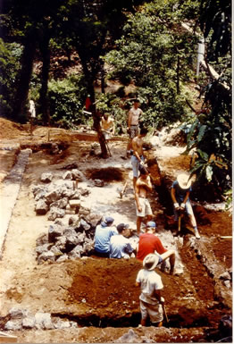
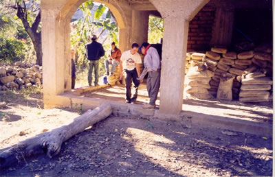
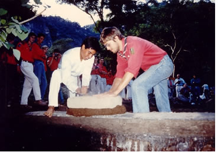
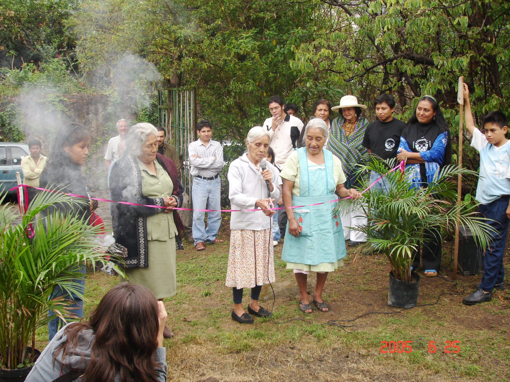


<!-- Content Area Start -->

  

    <h3>LA CREACIÓN</h3>
    
    
“Atekokolli” es un grupo que fue creado para beneficio social, así como generar actividades para el desarrollo comunitario. Por ejemplo: creación de fuentes de empleo impulsando actividades productivas propias del conocimiento de la gente. El propósito es difundir y conservar las tradiciones y costumbres de la comunidad. Fue formado en 1989, la idea fue transmitida por la antropóloga Carmen Cook mas tarde Lucio Pérez Villalba e Ignacio Torres Ramírez, fueron quienes decidieron realizar la idea. En 1992 la fundación “Gansos Salvajes” aportó la primera ayuda en base a la primera propuesta de Atekokolli, la cual fue solicitar material para instalar un laboratorio, pero al no tener donde hacer el laboratorio destinaron la ayuda económica para comprar un terreno con el fin de tener un espacio para la clínica y el laboratorio.

    
En el mismo año se obtiene una aportación monetaria y de mano de obra por parte de un grupo de scouts de Bélgica llamado “Core-Ann” así se empezaron a construir los cimientos.

    <h3>LA CONSTRUCCIÓN</h3>
    
    
En 1993 “Clinfoc” otro grupo de scouts de Bélgica, continuó el levantamiento del establecimiento que iniciaron sus compatriotas.

    
Los años subsecuentes llegaron varios grupos de estudiantes canadienses y norteamericanos de esta manera iba creciendo la edificación.

    
En 1995 con sus propios recursos, tras poner el techo terminaron la casa dejando en obra negra.

    
Año con año se iban implementando más cosas a la clínica, mediante recursos propios obtenidos por vender plantas de ornato, zetas y hongos, plantas medicinales, y también siguió el apoyo de simpatizantes del proyecto.

    
Finalmente en 2005 queda consolidado “Atekokolli”, tras el aporte económico de la CONANP (Comisión Nacional de Áreas Naturales Protegidas). Actualmente esta comisión destina más recursos para el proyecto de cultivar hortalizas orgánicas.

    

    Para continuar la evolución del proyecto “Atekokolli” será necesario el apoyo y la solidaridad de instituciones y fundaciones tanto nacionales como extranjeras. Ya que hoy día esta es solo la primera etapa.

    

    Les agradecemos de todo corazón la ayuda a todos aquellos que han estado en el crecimiento de “Atekokolli” sin ustedes esto no hubiera sido posible, siempre serán bienvenidos.

    
    <h3>ADQUISICÓN DEL CONOCIMIENTO</h3>
    
Durante los años que le seguían al inicio de la construcción, los miembros del grupo se preparaban en el conocimiento de la <strong>Medicina Tradicional</strong> quienes recibían de una Medico Tradicional la enseñanza de las plantas que curan, llamada Vicenta Villalba. Primeramente se aprende el nombre de las Plantas, su uso e importancia y posteriormente se inicia la elaboración de productos medicinales y cosméticos a base de plantas para después distribuirlos en la población, en festivales culturales, y en ferias de la salud.

    
Mencionamos también con un reconocimiento profundo a Doña Leocadia(qpd) por su legado familiar del conocimiento de la Medicina Tradicional, pues de ella, los jóvenes de Atekokolli recibieron la Herencia del conocimiento de las Abuelas y Abuelos Curanderos. SIEMPRE LA TENDREMOS EN NUESTRO CORAZON Y EN EL CORAZON DEL ATEKOKOLLI, SEPASE SEGURA QUE SU CONOCIMIENTO HEREDADO A ELLA Y DE ELLA A NOSOTROS, ESTARA UNA GENERACION MAS EN ESTA VIDA.

    

                        
  
          
<!-- Content area end -->

