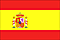


<!-- Content Area Start -->

  

   Alvarado Peralta F.(1992) « Ce-Acatl Topilztin Quetzalcoatl ». Ce-Acatl.   

Alvarado Peralta F. (1993) La Historia de Amatlan de Quetzalcoatl: Centro de Estudios Antropológicos, Científicos, Artísticos, Tradicionales y Linguisticos” Ce-Acatl”.  

Angel VD, Léon G.(2007) El secreto de las plantas: Ediciones Castillo . 56 p. ISBN : 9702008328, 9789702008323.  

Benito Juan (2015), Totepoztecatzintli, Señor del pulque y de Tepoztlán, Ica, Tepoztlán  

Cappiello, J. (2010) Acquisition, transmission et socialisation des savoirs locaux relatifs aux plantes médicinales à Amatlán de Quetzalcóatl, Mor. Le cas de la clinique de médecine traditionnelle “Atekokolli”. Tesis, MNHN,79p.  

Cappiello, J. (2010) Adquisición, transmision y socialisación de los saberes locales relativos a las plantes médicinales en Amatlán de Quetzalcóatl, Mor. El caso de la clinica de medecina tradicional “Atekokolli”. Tesis, MNHN,79p.  

Colley, D., Tlapatloya ‘Un lugar de curación’ – Como y porque la curación tradicional persiste en Amatlán (*)   

Chihu Amparan, A., 2000. Simbolos de identidad en los movimientos sociales de Amatlan y Tepoztan, Morelos. Cu: Centro de Investigación y Docencia en Humanidades del Estado de Morelos.(*)

Chihu Amparan, A., 2000. Simbolos de identidad en los movimientos sociales de Amatlan y Tepoztan, Morelos. Cu: Centro de Investigación y Docencia en Humanidades del Estado de Morelos.(*)   

Eibenshutz Gutiérrez, E., 2008. Panorama actual de una tradicón medica en Amatlán, México. México D.F: ENAH.(*)   

&nbsp;

Fuentes Juárez, G (2000) Sobrevivencia de la medicina tradicional. Tesis, UAM.   

Gispert, M., H. Rodríguez, B. Coutiño, A. Díaz y S. Peralta. (2006) Creación de un Jardín Etnobotánico en el recinto del Atekokolli de Amatlán de Quetzalcoátl, Morelos. Imprenta Guevara A. de C.V. México. 800 ejem. 15p.  

Gispert, M., H. Rodríguez, B. Coutiño, A. Díaz y S. Peralta. (2007) Catálogo de Plantas Medicinales y Alimentarias del Jardín Etnobotánico en Amatlán de Quetzalcóatl, Morelos. Tomo II. Guevara impresiones, S.A. de C.V. 31p. 1000 ejemplares. México, D. F.  

Gómez L. y E. Chong (1985). Conocimiento y usos de la flora de Amatlan, municipio de Tepoztlán, Morelos. Tesis, Facultad de Ciencias, UNAM.  

Hetterer Ariza, O.F., 2000. La Medicina Tradicional cuestionada. Antecedentes, Perpectivas y Prospectivas en México y Latinaoamperica Extra Excell Internacional, Academia Mexicana de Medicina Tradicional, A.C., México D.F.(*)   

Lillo Macina, V., 2007. El Temazcalli Mexicano. Su significación simbólica y su uso psicoterapéutico passado y presente Plaza y Valdes., Méx.(*)   

Madrigal Calle, B.E., 1994. Caracterización del Conocimiento Tradicional sobre plantas medicinales en dos comunidades de origen Nahuatl. Montecillo: Colegio de Postgraduados, Institución de enseñanza e investigación en ciencias agrícolas, Instituto de recursos naturales, programa de botánica.(*)   

Monroy-Ortiz C, Castillo EP (2000). Plantas medicinales utilizadas en el Estado de Morelos. UAEM México.  

Monroy-Ortíz C, Monroy R. (2006). Las plantas, compañeras de siempre: Universidad Autónoma del Estado de Morelos. 582 p. ISBN : 9688782424, 9789688782422  

Moore, M., 1992. Los Remedios Red Crane Books., Santa Fe.(*)   

Otero Campo, A.P. &amp; Rodríguez Pérez, M.D.C., 1999. La Medicina Tradicional desde los testimonios de curanderos del Estado de Morelos. Dans Las hojas de la comunidad.  Cuer, p. 247-263.(*)   

Rios Ruiz, V. (2001) Continuidad y cambio en el ciclo ritual de Amatlan, Morelos. Tesis, UAM. 94p –   

Villalba Campos, L., 1998. Diseño Grafico apliacado a envase ( Caso dentifrico natural). México: UNAM.(*)   

Zamora Díaz, F.V. (2007). Quetzalcóatl nació en Amatlán: Identidad y nación en un pueblo mesoamericano. Tesis, UAM. 109p.   

(*) Se encuentran en casa de dona Vicenta Villalba, en Amatlán de Quetzalcóatl, Mor.   
   

<!-- Content area end -->

